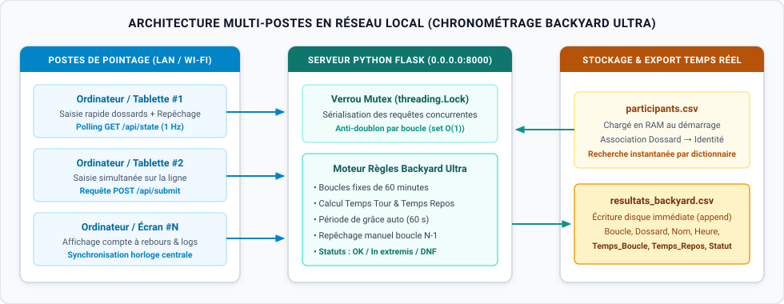

# Système de Chronométrage Multi-Postes — Backyard Ultra

-d97706?style=for-the-badge)


Application de chronométrage et de pointage de dossards en temps réel conçue pour les courses d'endurance au format **Backyard Ultra** (une boucle de 6,706 km à parcourir toutes les 60 minutes). Le système permet à plusieurs opérateurs connectés sur un même réseau local (Wi-Fi / LAN) de saisir simultanément les arrivées sur la ligne sans conflit d'écriture.

> **État du projet :** Ce dépôt est actuellement **en cours de développement actif** (*Work in Progress*). Le serveur multi-postes Flask (`app.py`) et la version locale Tkinter (`standalone_tkinter.py`) sont fonctionnels ; les fonctionnalités d'export avancé et le tableau de bord de suivi par coureur sont en cours d'implémentation.

---

## Sommaire
1. [Architecture réseau et fonctionnement](#architecture-réseau-et-fonctionnement)
2. [Règles métier gérées automatiquement](#règles-métier-gérées-automatiquement)
3. [Fonctionnalités implémentées et feuille de route (Roadmap)](#fonctionnalités-implémentées-et-feuille-de-route-roadmap)
4. [Structure du dépôt](#structure-du-dépôt)
5. [Installation et démarrage rapide](#installation-et-démarrage-rapide)

---

## Architecture réseau et fonctionnement



Lors d'une arrivée groupée sur la ligne, un seul opérateur peut difficilement saisir tous les numéros de dossards à la volée. Le projet propose deux implémentations complémentaires :

1. **Architecture Client-Serveur en réseau local (`app.py` — Flask) :**
   * Un ordinateur principal héberge le serveur Flask sur toutes les interfaces réseau (`0.0.0.0:8000`).
   * Plusieurs postes (ordinateurs, tablettes ou smartphones connectés au même réseau Wi-Fi/LAN) accèdent à l'interface web et valident les dossards en parallèle via l'API REST (`POST /api/submit`).
   * Un **verrou d'exclusion mutuelle (`threading.Lock()`)** protège la section critique pour garantir qu'aucun dossard n'est enregistré en doublon sur une même boucle et que les écritures dans `resultats_backyard.csv` sont strictement sérialisées.
   * Les interfaces clientes se synchronisent toutes les secondes (`GET /api/state`) sur l'horloge centrale du serveur et affichent le compte à rebours avant le départ de la boucle suivante (passage au rouge sous la barre des 3 minutes restantes).

2. **Application de bureau autonome (`standalone_tkinter.py` — Tkinter) :**
   * Interface graphique native légère destinée à un poste unique hors réseau, intégrant le compte à rebours, la détection de doublons par boucle et l'enregistrement CSV instantané.

---

## Règles métier gérées automatiquement

* **Calcul automatique des temps :** À chaque validation d'un numéro de dossard, le serveur calcule le **temps de boucle** écoulé depuis le départ de l'heure courante ainsi que le **temps de repos restant** avant le coup d'envoi de la boucle suivante.
* **Période de grâce automatique (*In extremis*) :** Si un coureur franchit la ligne sur le fil et que l'opérateur valide son dossard dans les 60 premières secondes de la nouvelle boucle (`DELAI_DE_GRACE_SECONDES = 60`), le système vérifie si ce coureur avait déjà été pointé sur la boucle précédente. S'il ne l'était pas, l'arrivée est automatiquement rattachée à la boucle $N-1$ avec le statut `OK (In extremis)`.
* **Repêchage manuel :** Un bouton dédié permet de rattacher manuellement un dossard oublié à la boucle précédente ($N-1$) sans fausser le pointage de la boucle en cours.

---

## Fonctionnalités implémentées et feuille de route (Roadmap)

### Fonctionnalités opérationnelles
- [x] Serveur HTTP local multi-postes sous Flask (`host="0.0.0.0"`, port `8000`)
- [x] Synchronisation temps réel de l'horloge de course et des 15 derniers passages sur tous les écrans connectés
- [x] Protection contre les accès concurrents par mutex (`threading.Lock()`) et anti-doublon par boucle
- [x] Association automatique `Dossard -> Prénom Nom` depuis `participants.csv`
- [x] Gestion de la période de grâce automatique (60 s) et du repêchage manuel sur la boucle $N-1$
- [x] Sauvegarde persistante au fil de l'eau dans `resultats_backyard.csv`
- [x] Version native autonome sous Tkinter (`standalone_tkinter.py`)

### En cours de développement (À venir)
- [ ] Reprise sur panne serveur : rechargement automatique de l'état de la course à partir de `resultats_backyard.csv` en cas de redémarrage du script
- [ ] Vue globale des coureurs encore en lice (identification automatique des coureurs non pointés à la fin du compte à rebours)
- [ ] Classement en direct (nombre de boucles validées, temps cumulé en course et temps moyen par tour)
- [ ] Interface d'administration pour ajouter/modifier un participant en cours d'épreuve

---

## Structure du dépôt

```text
backyard-ultra-race-tracker/
├── .gitignore
├── README.md
├── requirements.txt                # Dépendances Python (Flask)
├── app.py                          # Serveur web multi-postes (Flask + API REST + UI)
├── standalone_tkinter.py           # Version desktop mono-poste (Tkinter)
├── participants.csv                # Fichier d'exemple des coureurs inscrits
└── assets/
    └── network_architecture.svg    # Schéma d'architecture client-serveur LAN
```

---

## Installation et démarrage rapide

### 1. Prérequis
```bash
git clone [https://github.com/AurelienCapron/backyard-ultra-race-tracker.git](https://github.com/AurelienCapron/backyard-ultra-race-tracker.git)
cd backyard-ultra-race-tracker
pip install -r requirements.txt
```

### 2. Lancer le serveur multi-postes (Flask)
1. Renseigner la liste des coureurs dans `participants.csv` (colonnes : `Dossard,Nom,Prenom`).
2. Démarrer le serveur :
   ```bash
   python3 app.py
   ```
3. Sur le poste principal, ouvrir `http://localhost:8000`.
4. Sur les autres ordinateurs ou téléphones connectés au même réseau Wi-Fi, ouvrir `http://<IP_LOCALE_DU_SERVEUR>:8000`.

### 3. Lancer la version locale mono-poste (Tkinter)
```bash
python3 standalone_tkinter.py
```

---

## Auteur

Développé par **Aurélien Capron** — Élève-ingénieur à **Grenoble INP - Phelma**.