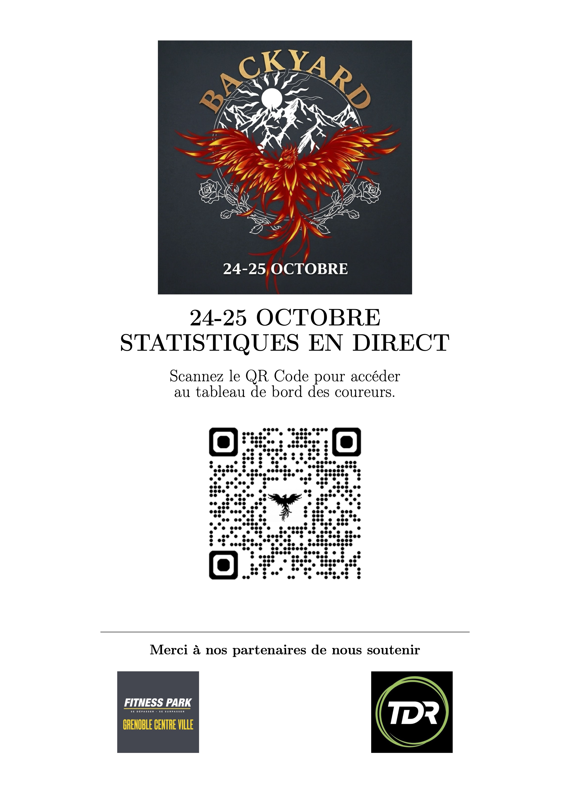

# Système de Chronométrage Multi-Postes — Backyard Ultra


Application de chronométrage et de pointage de dossards en temps réel conçue pour la course d'endurance au format **Backyard Ultra** (une boucle de 6,706 km à parcourir toutes les 60 minutes). Le système permet à plusieurs opérateurs connectés sur un même réseau local (Wi-Fi / LAN) de saisir simultanément les arrivées sur la ligne sans conflit d'écriture, et aux coureurs de consulter leurs statistiques à distance via un tunnel ngrok.

> **Contexte du projet :** Ce projet a été développé par Aurélien Capron pour l'événement "Backyard de Phelma", organisé les 24 et 25 octobre 2026. L'architecture globale, la logique métier et le code ont été élaborés avec l'assistance d'une Intelligence Artificielle (Gemini) pour garantir un développement rapide, un fonctionnement robuste et des interfaces adaptées au temps réel.

---

## Sommaire
1. [Architecture réseau et fonctionnement](#architecture-réseau-et-fonctionnement)
2. [Règles métier gérées automatiquement](#règles-métier-gérées-automatiquement)
3. [Fonctionnalités implémentées](#fonctionnalités-implémentées)
4. [Aperçu des interfaces](#aperçu-des-interfaces)
5. [Structure du dépôt](#structure-du-dépôt)
6. [Installation et démarrage rapide](#installation-et-démarrage-rapide)

---

## Architecture réseau et fonctionnement

Lors d'une arrivée groupée sur la ligne, un seul opérateur peut difficilement saisir tous les numéros de dossards à la volée. Le projet propose une architecture Client-Serveur en réseau local (`app.py` — Flask) ouverte sur l'extérieur via **ngrok** :

* Un ordinateur principal héberge le serveur Flask sur toutes les interfaces réseau (`0.0.0.0:8000`).
* Plusieurs postes (ordinateurs, tablettes ou smartphones connectés au même réseau) accèdent à l'interface web et valident les dossards en parallèle via l'API REST (`POST /api/submit`).
* Un tunnel **ngrok** est utilisé pour exposer le serveur local sur Internet de manière sécurisée. Cela permet aux coureurs, peu importe où ils se trouvent sur le parcours ou au camp de base, d'accéder à la "Borne Coureur" (`/coureur`) depuis leur propre smartphone en 4G pour consulter leurs statistiques en direct.
* Un **verrou d'exclusion mutuelle (`threading.Lock()`)** protège la section critique pour garantir qu'aucun dossard n'est enregistré en doublon sur une même boucle et que les écritures dans `resultats_backyard.csv` sont strictement sérialisées.

---

## Règles métier gérées automatiquement

- **Calcul automatique des temps :** À chaque validation d'un numéro de dossard, le serveur calcule le **temps de boucle** écoulé depuis le départ de l'heure courante ainsi que le **temps de repos restant** avant le coup d'envoi de la boucle suivante.
- **Période de grâce automatique (*In extremis*) :** Si un coureur franchit la ligne sur le fil et que l'opérateur valide son dossard dans les 60 premières secondes de la nouvelle boucle (`DELAI_DE_GRACE_SECONDES = 60`), l'arrivée est rattachée à la boucle N-1 avec le statut `OK (In extremis)`.
- **Classement dynamique :** Le classement se base en priorité sur le **nombre total de boucles validées** (ordre décroissant). En cas d'égalité, les coureurs sont départagés par leur **temps moyen par boucle** (le plus rapide l'emporte).

---

## Fonctionnalités implémentées

- [x] Serveur HTTP local multi-postes sous Flask (`host="0.0.0.0"`, port `8000`)
- [x] Accès coureurs via tunnel Internet (ngrok)
- [x] Synchronisation temps réel de l'horloge de course sur tous les écrans connectés
- [x] Protection contre les accès concurrents par mutex (`threading.Lock()`)
- [x] Association automatique `Dossard -> Prénom Nom` depuis `participants.csv`
- [x] Sauvegarde persistante au fil de l'eau dans `resultats_backyard.csv`
- [x] Export avancé des classements et temps individuels au format Excel (fichiers globaux et statuts des éliminations par boucle)
- [x] Tableau de bord interactif par coureur (Borne interactive `/coureur`)
- [x] Affichage TV optimisé (Viewport Units) adaptatif pour grand écran (`/tv`)
- [x] Écran "Speaker" détaillé listant les coureurs sur le parcours et les arrivants en direct (`/speaker`)
- [x] Roulette d'animation (Tirage au sort dynamique parmi les participants en lice) (`/roulette`)
- [x] Reprise sur panne : rechargement automatique de l'état de la course à partir de `resultats_backyard.csv` en cas de redémarrage.

---

## Aperçu des interfaces

| Pupitre de pointage | Affichage TV (Leaderboard) |
| :---: | :---: |
|  |  |
| *Interface de contrôle principale, sécurisée par code PIN.* | *Tableau de bord auto-adaptatif pour affichage sur vidéoprojecteur.* |

| Écran Speaker | Tableau de Classement |
| :---: | :---: |
|  |  |
| *Vue détaillée de l'état du peloton pour l'animation.* | *Classement en direct avec fonctions d'export Excel.* |

| Borne Coureur | Page Podium |
| :---: | :---: |
|  |  |
| *Affiche scannable via QR code menant aux statistiques individuelles via ngrok.* | *Résultats finaux et records absolus de l'épreuve.* |

---

## Structure du dépôt

```text
backyard-ultra-race-tracker/
├── .gitignore
├── README.md
├── requirements.txt                # Dépendances Python (Flask, openpyxl)
├── app.py                          # Serveur web multi-postes (Flask + API REST + UIs HTML)
├── participants.csv                # Fichier source des coureurs inscrits
├── resultats_backyard.csv          # Fichier de base de données de la course généré automatiquement
├── assets/                         # Dossier contenant les captures d'écran et ressources
│   ├── Capture d'écran page Classement.png
│   ├── Capture d'écran page pointage.png
│   ├── Capture d'écran page Podium.png
│   ├── Capture d'écran page Speaker.png
│   ├── Capture d'écran page TV.png
│   └── QRcode_Stats_Backyard.jpg
└── static/
    ├── logo_backyard.png           # Logo de l'événement
    ├── logo_tdr.png                # Logo du partenaire TDR
    └── logo_fitness_park.png       # Logo du partenaire Fitness Park
